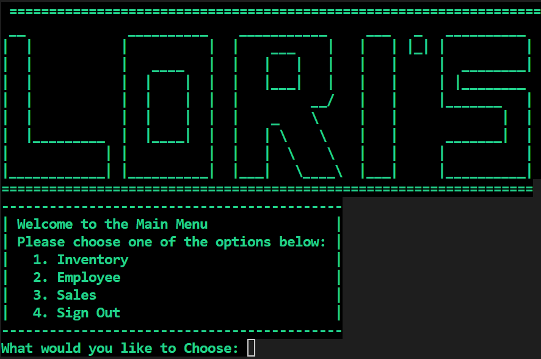
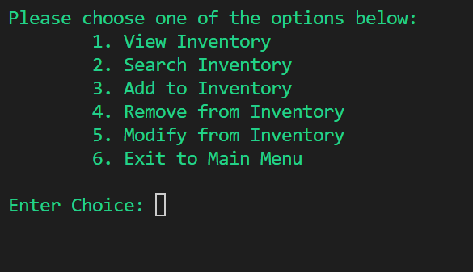
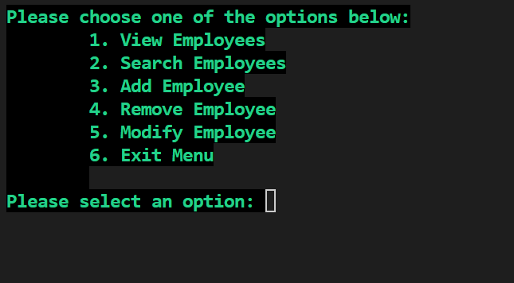
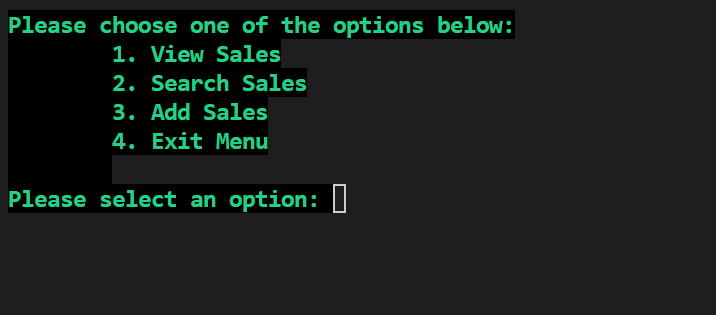

# Grocer Management System

## Introduction
### Project Overview
The Grocer Management System is a robust and user-friendly application designed to streamline the operations of grocery stores. It features comprehensive modules for employee management, inventory tracking, sales processing, and data encryption for secure access. This system is developed using Python and SQLite, ensuring a lightweight yet powerful solution for managing day-to-day store activities.

### Technologies Used
- **Python:** For building the core application logic.
- **SQLite:** Used for database management and storage.
- **Other Libraries:** `stdiomask` for password masking, `os` for system operations.

## Features
### Detailed Feature List
1. **Employee Management:** Handles employee data, including personal details, position, and salary.
2. **Inventory Tracking:** Efficient management of store inventory with search and update functionalities.
3. **Sales Processing:** Facilitates the recording and tracking of sales transactions.
4. **Secure Access:** Implements encryption and secure sign-in to protect sensitive data.
5. **Error Handling:** Robust error-checking mechanisms to ensure smooth operation.

### Screenshots

## Installation and Setup
### Prerequisites
- Python 3.x
- SQLite3

### Installation Guide
1. Clone the repository or download the source code.
2. Install required Python libraries: `pip install sqlite3 stdiomask`
3. Run `main.py` to start the application.

## Usage
- **Starting the Application:** Run `python main.py` from the command line.
- **Navigating Menus:** Follow the on-screen prompts to access different functionalities.

## Project Structure

Each file in the Grocer Management System plays a specific role. Here's a brief overview of their functions:

### `employee.py`
Handles operations related to employee data management, such as displaying employee-related items.

### `encryption.py`
Manages the secure sign-in process, including user authentication and password encryption.

### `error.py`
Contains functions for error checking and validation, ensuring robust input handling throughout the application.

### `functions.py`
A utility file that stores various functions for Read, Update, and Delete operations, along with other utility functions like screen clearing.

### `inventory.py`
Facilitates inventory management, including displaying and updating inventory items.

### `main.py`
The main driver of the application, responsible for displaying menus, submenus, and initiating function calls for various modules.

### `sales.py`
Manages functionalities related to sales, including recording and processing sales transactions.

### `table.py`
Initializes the database and sets up the necessary tables, serving as the foundation for data storage in the system.

## Testing
The application has been thoroughly tested for various scenarios, including database integrity, user input validation, and error handling. 

## Contributing
Contributions to improve the Grocer Management System are welcome. Please refer to the contributing guidelines for more information.

## Authors and Acknowledgment
- **Developed by:** Omar Bakr
- **Acknowledgments:** Grateful to all who provided feedback and suggestions.

## License
This project is released under the [MIT License](https://opensource.org/licenses/MIT).

## Contact Information
- **Email:** omarcodes2@gmail.com
- **LinkedIn:** https://www.linkedin.com/in/omarbakr03/
